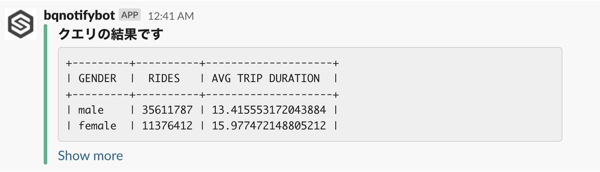

# Example

## How to run with Cloud Functions/Cloud Scheduler

```sh
$ gcloud pubsub topics create bqnotify

$ gcloud functions deploy BqNotify \
    --project mizzy-270104 \
    --region asia-northeast1 \
    --runtime go113 \
    --trigger-topic bqnotify \
    --set-env-vars SLACK_WEBHOOK_URL=$SLACK_WEBHOOK_URL \
    --set-env-vars BQNOTIFY_PROJECT=mizzy-270104

$ gcloud scheduler jobs create pubsub bqnotify \
  --project mizzy-270104 \
  --message-body {} \
  --topic bqnotify \
  --schedule '0 0 * * *'
```

## Notification result example


